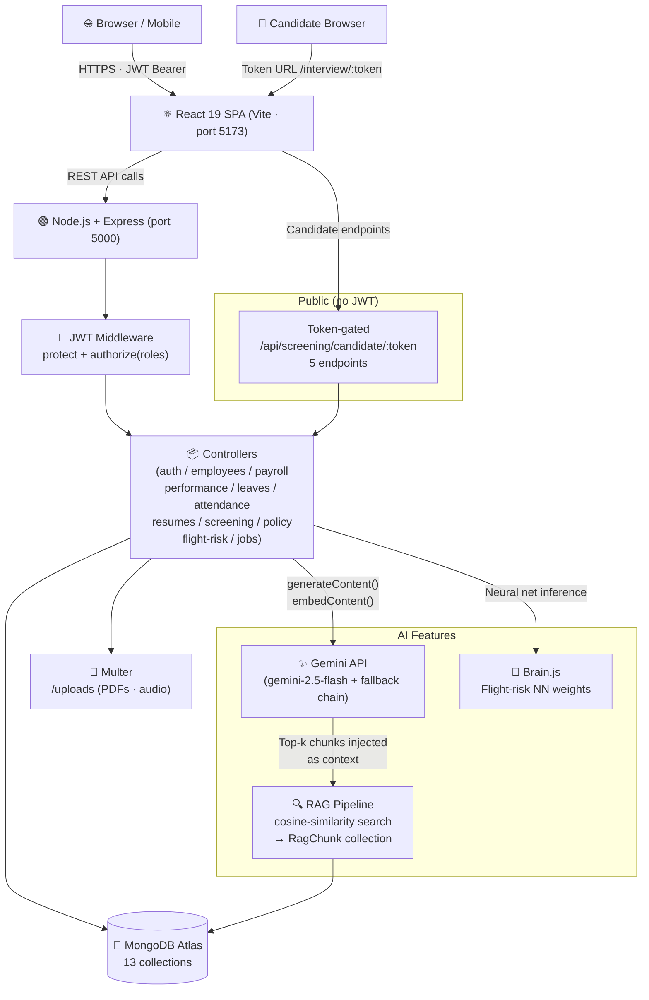

# FWC HRMS — AI-Powered Human Resource Management System

> **FWC AI/ML Fullstack Hackathon Submission**  
> Theme: *Build the Future of HR Management with AI-Powered Solutions*

A next-generation HRMS that uses Gemini AI, RAG pipelines, and a neural network to automate and streamline HR operations across four user roles.

---

## Demo Accounts

| Role | Email | Password |
|------|-------|----------|
| Admin | admin@fwchrms.com | Admin@1234 |
| HR Recruiter | hr@fwchrms.com | Admin@1234 |
| Senior Manager | manager@fwchrms.com | Admin@1234 |
| Employee (Dev 1) | dev1@fwchrms.com | Admin@1234 |
| Employee (Dev 2) | dev2@fwchrms.com | Admin@1234 |
| Employee (Dev 3) | dev3@fwchrms.com | Admin@1234 |

---

## AI Features (7 Implemented)

1. **Blind Resume Screening** — RAG + Gemini evaluates resumes against job descriptions with PII hidden until shortlisting, eliminating unconscious bias
2. **Dynamic AI Interviews** — Gemini conducts 8-turn adaptive text interviews with follow-up questions based on candidate responses
3. **Candidate Proctoring** — Page Visibility API + `window.blur` detects tab-switching and focus loss during interviews; flags session after 3 violations
4. **Flight Risk Neural Network** — Brain.js neural network trained on attendance, performance, and leave data predicts employee churn risk (low/medium/high/critical)
5. **HR Policy RAG Chatbot** — Employees ask natural-language questions about company policies; answers grounded in uploaded policy documents via vector search + Gemini
6. **AI Interview Analysis** — Gemini scores each interview on communication, technical depth, and confidence; generates hire/no-hire verdict with key insights

---

## Tech Stack

| Layer | Technologies |
|-------|-------------|
| Frontend | React 19, React Router 7, TanStack React Query, Vite |
| Backend | Node.js, Express.js |
| Database | MongoDB with Mongoose ODM |
| AI / ML | Google Gemini API (gemini-2.5-flash + fallback chain), Brain.js |
| Auth | JWT + bcrypt, role-based access control (RBAC) |
| File Uploads | Multer (resumes, audio, policy PDFs) |
| Real-time | Socket.io |
| Styling | Custom CSS design system (no UI library) |

---

## Core Modules

| Module | Roles with Access |
|--------|------------------|
| Employee Management | Admin, Manager |
| Attendance (check-in/out + team view) | Admin, Manager, Employee |
| Payroll Management | HR (full), Admin (full), Employee (own only) |
| Performance Reviews | Manager/Admin (create + manage), Employee (view + acknowledge) |
| Leave Management | Employee (apply), Manager/Admin (approve/reject) |
| AI Resume Screening | HR |
| AI Interviews + Proctoring | HR (manage), Candidate (attend via unique link) |
| Candidate Pipeline + Analytics | HR |
| Flight Risk Analysis | Admin, Manager |
| HR Policy RAG Chatbot | Employee |
| User Management | Admin only |

---

## Architecture Overview

The project is a monorepo with `backend/` (Node/Express REST API) and `frontend/` (React SPA).

**Auth flow**: JWT issued on login, attached via Axios interceptor, verified by `protect` middleware. Role enforced by `authorize(...roles)` middleware per route.

**RAG pipeline**: PDFs chunked and embedded via Gemini embedding model → stored in MongoDB as vectors → cosine similarity search at query time → top chunks injected into Gemini prompt as context.

**Gemini fallback chain**: `geminiService.js` tries models in order (`gemini-2.5-flash` → `gemini-2.5-flash-lite` → `gemini-2.0-flash` → `gemini-1.5-flash`) catching 404/429/503 errors with 300ms sleep between attempts.

**Candidate interview portal**: HR generates a token-gated link (48h expiry). Candidate opens `/interview/:token` (no login required). Voice recorded via MediaRecorder → transcribed by Gemini server-side → returned as text. Proctoring events recorded silently in the background.

---

## Setup & Running

### Prerequisites
- Node.js 18+
- MongoDB (local or Atlas)
- Google Gemini API key (free tier at ai.google.dev)

### Backend
```bash
cd backend
npm install
cp .env.example .env    # fill in your values
npm run dev
```

### Frontend
```bash
cd frontend
npm install
npm run dev
```

### Environment Variables (`backend/.env`)
```
MONGO_URI=mongodb://localhost:27017/fwchrms
JWT_SECRET=your_jwt_secret_here
GEMINI_API_KEY=your_gemini_api_key_here
CLIENT_URL=http://localhost:5173
PORT=5000
NODE_ENV=development
```

### Seed Sample Data
```bash
# 1. Reset DB and create admin + HR accounts
node backend/scripts/resetDB.js

# 2. Add 3 developer employees with 90 days of real data
node backend/scripts/seedData.js
```

---

## Deployment (Render.com)

### One-time setup
1. Push this repo to GitHub
2. Go to [render.com](https://render.com) → New → Blueprint → connect repo
3. Render auto-detects `render.yaml` and creates both services (backend web service + frontend static site)

### Environment variables to set in the Render dashboard
| Variable | Service | Value |
|----------|---------|-------|
| `MONGO_URI` | Backend | MongoDB Atlas connection string |
| `JWT_SECRET` | Backend | Any long random string (32+ chars) |
| `GEMINI_API_KEY` | Backend | From [ai.google.dev](https://ai.google.dev) (free tier) |
| `CLIENT_URL` | Backend | Your frontend Render URL (e.g. `https://fwc-hrms-frontend.onrender.com`) |
| `VITE_API_URL` | Frontend | Your backend Render URL + `/api` (e.g. `https://fwc-hrms-backend.onrender.com/api`) |

### After first deploy — seed the database
Open the backend service in Render → Shell tab, then run:
```bash
node scripts/resetDB.js   # creates admin + HR accounts
node scripts/seedData.js  # adds 3 dev employees with 90 days of realistic data
```

---

## Project Structure

```
fwc-hrms-v2/
├── backend/
│   ├── controllers/      # Business logic per domain
│   ├── models/           # Mongoose schemas
│   ├── routes/           # Express routers with RBAC middleware
│   ├── services/         # Gemini AI service + fallback chain
│   ├── middleware/        # JWT protect + role authorize
│   ├── ml_models/        # Brain.js flight risk model weights
│   ├── scripts/          # DB reset + seed scripts
│   └── server.js
└── frontend/
    ├── src/
    │   ├── api/           # Axios instances + API helpers
    │   ├── context/       # AuthContext (JWT + user state)
    │   └── pages/
    │       ├── dashboard/ # Role-specific dashboard pages
    │       └── CandidateInterviewPage.jsx  # Public candidate portal
    └── index.html
```

---

## Architecture



**Auth flow:** JWT issued on login → attached via Axios interceptor → verified by `protect` middleware → role checked by `authorize(...roles)`.

**Gemini fallback chain:** `geminiService.js` tries `gemini-2.5-flash` → `gemini-2.5-flash-lite` → `gemini-2.0-flash` → `gemini-1.5-flash`, catching 404/429/503 with 300 ms back-off.

**RAG pipeline:** PDFs chunked → embedded via `embedContent()` → stored as vectors in MongoDB `ragchunks` collection → cosine similarity at query time → top chunks injected into Gemini prompt.

---

## API Reference

> Base URL: `http://localhost:5000/api`  
> Protected routes require `Authorization: Bearer <jwt>` header.  
> Candidate routes use a per-session token in the URL path instead of JWT.

### Authentication — `/api/auth`

| Method | Endpoint | Description | Auth |
|--------|----------|-------------|------|
| POST | `/register` | Register a new user | Public |
| POST | `/login` | Login → returns JWT | Public |
| GET | `/me` | Get current user profile | All |
| PUT | `/update-password` | Change password | All |
| POST | `/logout` | Logout / invalidate | All |

### Employees — `/api/employees`

| Method | Endpoint | Description | Roles |
|--------|----------|-------------|-------|
| GET | `/me` | Own employee profile | All |
| GET | `/me/stats` | Own personal stats | All |
| GET | `/stats` | Company-wide stats | Admin, Manager |
| GET | `/departments` | List departments | Admin, Manager, HR |
| GET | `/attendance/today` | Today's attendance summary | Admin, Manager |
| GET | `/` | List all employees | Admin, Manager, HR |
| POST | `/` | Create employee | Admin |
| GET | `/:id` | Get employee by ID | All |
| PUT | `/:id` | Update employee | All |
| DELETE | `/:id` | Deactivate employee | Admin |
| PATCH | `/:id/role` | Change user role | Admin |
| PATCH | `/:id/toggle-active` | Activate / deactivate account | Admin |

### Jobs — `/api/jobs`

| Method | Endpoint | Description | Roles |
|--------|----------|-------------|-------|
| GET | `/` | List all job postings | Admin, Manager, HR |
| POST | `/` | Create job posting | Admin, HR |
| PUT | `/:id` | Update job posting | Admin, HR |

### Resumes — `/api/resumes`

| Method | Endpoint | Description | Roles |
|--------|----------|-------------|-------|
| GET | `/jobs` | Jobs list for screener | Admin, HR |
| GET | `/` | List all resumes | Admin, HR |
| POST | `/upload` | Upload + AI screen resume | Admin, HR |
| GET | `/:id` | Get resume by ID | Admin, HR |
| PATCH | `/:id/shortlist` | Shortlist candidate | Admin, HR |
| PATCH | `/:id/reject` | Reject candidate | Admin, HR |

### Screening (HR-managed) — `/api/screening`

| Method | Endpoint | Description | Roles |
|--------|----------|-------------|-------|
| GET | `/` | List all sessions | Admin, HR |
| POST | `/create` | Create screening session | Admin, HR |
| GET | `/:id` | Get session details | Admin, HR |
| POST | `/:id/generate-link` | Generate candidate token link | Admin, HR |
| POST | `/:id/message` | Send message in session | Admin, HR |
| POST | `/:id/end` | End session + trigger analysis | Admin, HR |

### Candidate Portal (token-gated, no JWT) — `/api/screening/candidate`

| Method | Endpoint | Description |
|--------|----------|-------------|
| GET | `/:token` | Fetch session for candidate |
| POST | `/:token/message` | Send candidate answer → AI reply |
| POST | `/:token/end` | End session early |
| POST | `/:token/proctoring-event` | Record tab-switch / focus-loss |
| POST | `/transcribe` | Transcribe audio (Gemini STT) |

### Attendance — `/api/attendance`

| Method | Endpoint | Description | Roles |
|--------|----------|-------------|-------|
| POST | `/check-in` | Clock in | All |
| POST | `/check-out` | Clock out | All |
| GET | `/today` | Today's record for current user | All |
| GET | `/my` | Own attendance history | All |
| GET | `/summary` | Company attendance summary | Admin, Manager |
| GET | `/` | All attendance records | Admin, Manager |
| POST | `/mark` | Mark attendance for employee | Admin, Manager |

### Payroll — `/api/payroll`

| Method | Endpoint | Description | Roles |
|--------|----------|-------------|-------|
| GET | `/my` | Own payslips | All |
| GET | `/summary` | Payroll summary stats | Admin, HR |
| GET | `/` | All payroll records | Admin, HR |
| POST | `/` | Create payslip | Admin, HR |
| PATCH | `/:id/status` | Update status (pending→processed→paid) | Admin, HR |
| DELETE | `/:id` | Delete payslip | Admin |

### Performance — `/api/performance`

| Method | Endpoint | Description | Roles |
|--------|----------|-------------|-------|
| GET | `/my` | Own performance reviews | All |
| GET | `/` | All reviews | Admin, Manager |
| POST | `/` | Create review (AI summary generated) | Admin, Manager |
| PATCH | `/:id/acknowledge` | Employee acknowledges review | All |
| PATCH | `/:id` | Update review | Admin, Manager |

### Leaves — `/api/leaves`

| Method | Endpoint | Description | Roles |
|--------|----------|-------------|-------|
| GET | `/` | Get leave requests | All |
| POST | `/` | Apply for leave | All |
| PATCH | `/:id/:action` | approve / reject / cancel | Admin, Manager |

### Flight Risk — `/api/flight-risk`

| Method | Endpoint | Description | Roles |
|--------|----------|-------------|-------|
| GET | `/` | All employee risk assessments | Admin, Manager |
| GET | `/:employeeId` | Single employee risk | Admin, Manager |
| POST | `/run` | Run Brain.js NN on all employees | Admin |
| POST | `/retrain` | Retrain NN with latest data | Admin |
| PATCH | `/:id/resolve` | Mark risk as resolved | Admin, Manager |

### Policy Documents — `/api/policy`

| Method | Endpoint | Description | Roles |
|--------|----------|-------------|-------|
| GET | `/` | List all policy docs | All |
| POST | `/ask` | RAG chatbot query | All |
| POST | `/upload` | Upload PDF + chunk + embed | Admin |
| PATCH | `/:id/toggle` | Enable / disable policy | Admin |
| DELETE | `/:id` | Delete policy | Admin |

---

## Hackathon Requirements Checklist

| Requirement | Status |
|------------|--------|
| At least 4 AI features | ✅ 7 implemented |
| All core HRMS modules (employee, attendance, payroll, performance, leaves) | ✅ |
| Multi-role login (Admin, Manager, HR, Employee) | ✅ |
| Personalized dashboards per role | ✅ |
| AI-driven resume screening without human intervention | ✅ |
| AI-powered voice interaction for candidate screening | ✅ |
| Open-source libraries only | ✅ |
| Mobile responsive design | ✅ |
| Free-tier APIs only | ✅ Gemini free tier |
